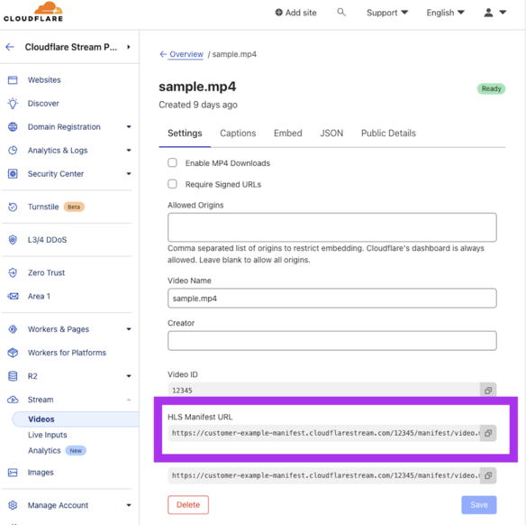

# ☁️ Cloudflare Stream Video Downloader

Utility to download MP4 videos and individual [MPEG-TS](https://en.wikipedia.org/wiki/MPEG_transport_stream) segments for varying resolutions off a [Cloudflare Stream](https://developers.cloudflare.com/stream/) HLS manifest URL.

## Supports
- ✅ Download video and segments
- ✅ List available resolutions & manifests
- ✅ Upload support
- ✅ Count number of segments

## Installation
```
go install github.com/Schachte/cloudflare-stream-downloader@master
```

### Troubleshooting

- Make sure you have Go installed on your system - [download here](https://go.dev/doc/install)
- Make sure you `GOPATH` and `GOBIN` values are set correctly

Example:
```
GOPATH=$HOME/Documents/go
GOBIN=$GOPATH/bin
PATH=$PATH:$GOBIN
go install github.com/Schachte/cloudflare-stream-downloader@master

cloudflare-stream-downloader <HLS MANIFEST URL>
```

## Usage
```sh
cloudflare-stream-downloader --manifestUrl <HLS_MANIFEST_URL> --output  <absolute path to output folder>

#If an output path is not provided then it will be saved to the directory where the binary is executed
```

For building the binary, see section below on `Builds & Releases` or [download latest release here.](https://github.com/Schachte/cloudflare-stream-downloader/releases)

You can grab the HLS manifest from the Cloudflare Dash as shown in the image below:



In case you wish to download an embedded video on a different site and you don't have the access to the Cloudflare Dash, get to the frame's source code, find the poster url in the following format `https://customer-<CODE>.cloudflarestream.com/<UID>/thumbnails/thumbnail.jpg` and replace `thumbnail/thumbnanil.jpg` with `manifest/video.m3u8`. Example URL: `https://customer-f33zs165nr7gyfy4.cloudflarestream.com/6b9e68b07dfee8cc2d116e4c51d6a957/manifest/video.m3u8`

## Example Output
```
cloudflare-stream-downloader --manifestUrl https://.../manifest/video.m3u8 --outputPath <absolute path to output folder>

Use the arrow keys to navigate: ↓ ↑ → ←
? Cloudflare Stream Downloader::
  ▸ Download video and segments
    List available resolutions
    Count number of segments
    🚫 Exit

✔ Download video and segments
📋 Listing all available resolutions for video UID: f92743594bb2d9471c8ef80b9437c1ff

0) 766x360
1) 510x240
2) 🚫 Exit

📼 Select resolution: 0
🌱 Beginning download for [766x360]
10% complete
20% complete
30% complete
40% complete
50% complete
60% complete
70% complete
80% complete
90% complete
Complete!
---------------------------------------------
Video output:
./f92743594bb2d9471c8ef80b9437c1ff/766x360/f92743594bb2d9471c8ef80b9437c1ff.mp4

Segments output:
./f92743594bb2d9471c8ef80b9437c1ff/766x360/segments/

Playback:
ffplay ./f92743594bb2d9471c8ef80b9437c1ff/766x360/f92743594bb2d9471c8ef80b9437c1ff.mp4
---------------------------------------------
```

## Builds & Releases

### Releases 

[Download latest release here.](https://github.com/Schachte/cloudflare-stream-downloader/releases)

or 

You can also run the latest builds for all operating systems by running: `make all`. 
